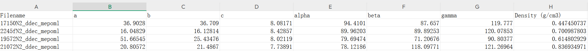
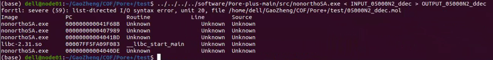

# Pore+ Input File Preparation Guide  
# Pore+ 输入文件准备指南

This document describes how to prepare all required input files for **Pore+**, including extraction of crystal structure parameters, CIF → MOL conversion, and setup for running the main Pore+ calculations.

本文档介绍如何为 **Pore+** 准备所有必要的输入文件，包括晶体结构参数提取、CIF→MOL 转换，以及主程序运行前的准备步骤。

---

# 📚 Table of Contents  
# 📚 目录
- [Overview / 概述](#overview--概述)  
- [Step 1 — Extract Crystal Structure / 第一步：提取晶体结构参数](#step-1--extract-crystal-structure--第一步提取晶体结构参数)  
- [Step 2 — Convert CIF to MOL / 第二步：CIF 转换为 MOL](#step-2--convert-cif-to-mol--第二步cif-转换为-mol)  
- [Step 3 — Run Pore+ / 第三步：开始 Pore+ 计算](#step-3--run-pore--第三步开始-pore-计算)  
- [Summary / 总结](#summary--总结)

---

# Overview / 概述

This workflow prepares all essential input files for **Pore+**, including:
- Extracting unit cell parameters and density
- Converting crystal structure files (CIF) to MOL
- Preparing INPUT and auxiliary files
- Running the Pore+ surface area (SA) workflow

本流程用于生成 **Pore+** 所需的全部输入文件，包括：
- 提取晶胞参数与密度  
- 将 CIF 转换为 MOL  
- 准备 INPUT 与辅助文件  
- 执行 Pore+ 的比表面积（SA）计算流程  

---

# Step 1 — Extract Crystal Structure  
# 第一步：提取晶体结构参数

## 🔧 What to Do / 操作步骤

Edit `get_cell.py` and modify:
- The path of the CIF structure files  
- The output CSV filename  

编辑 `get_cell.py`，修改：
- CIF 文件所在路径  
- 输出 CSV 文件名  

Then run / 运行：

```bash
python get_cell.py
````

This script outputs:

* Unit-cell parameters (Å)
* Density (g/cm³)
* Original CIF filenames

脚本将输出：

* 晶胞参数（单位 Å）
* 密度（单位 g/cm³）
* CIF 文件完整名称

---

## ⚠ Important Notes / 注意事项

### 1. CIF suffix removal

The first column in the CSV contains full filenames, but **Pore+ INPUT only requires the filename without `.cif`**.

CSV 第一列为完整文件名，但 **Pore+ 的 INPUT 只需要去掉 `.cif` 的文件名**。

Use Excel to remove `.cif`:

```
=LEFT(A2, LEN(A2) - 4)
```

---



---

# Step 2 — Convert CIF to MOL

# 第二步：CIF 转换为 MOL

Pore+ requires **MOL files**, but raw structure files are **CIF**.
Use `CIF2MOL.py` to generate valid MOL files.

Pore+ 需要 **MOL 文件**，但原始结构为 **CIF**。
使用 `CIF2MOL.py` 自动生成符合要求的 MOL 文件。

---

## 🔧 How to Run / 操作步骤

Modify paths in `CIF2MOL.py`:

* CIF input folder
* Output MOL folder

修改 `CIF2MOL.py` 中的路径：

* CIF 输入文件夹
* MOL 输出文件夹

Then run / 运行：

```bash
python CIF2MOL.py
```

---

## ⚠ Notes / 注意事项

Directly converting using Python + OpenBabel often produces errors or incompatible geometries.

直接使用 Python + OpenBabel 转换常导致错误或生成不符合 Pore+ 要求的文件。

Example error / 示例错误：



`CIF2MOL.py` avoids such issues and ensures correct formatting.

`CIF2MOL.py` 能避免这些问题，并生成格式正确的 MOL 文件。

---

# Step 3 — Run Pore+

# 第三步：开始 Pore+ 计算

## 🔧 Preparation / 前期准备

Create a new working directory and copy the following files:

创建新的计算文件夹，并复制以下文件：

* `INPUT`
* `CCDC.atoms`
* `POCs.charges`
* `symbol2name.map`
* `*_lattice_density.csv` (from Step 1)
* `Run_SA_main.sh`

---

## ✏ Modify Run_SA_main.sh

Open the script and update:

修改 `Run_SA_main.sh` 中：

* Path to the crystal structure folder

* Structure filenames (without `.cif`)

* CIF 文件所在路径

* 晶体结构文件名（不带 `.cif`）

---

## ▶ Start the calculation / 开始计算

```bash
./Run_SA_main.sh
```

This launches the Pore+ surface area workflow.

运行后将启动 Pore+ 的比表面积计算流程。

---

# 版本信息

Pore+ v1.0  
date: 2025-12-02
author: Z.GA
Email: gaozheng@stu.xjtu.edu.cn
